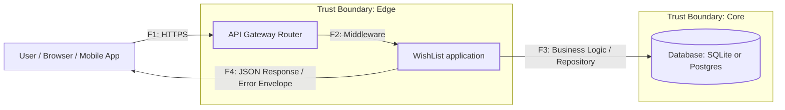

# DFD: Общий контекст системы

Высокоуровневая диаграмма потока данных для Wishlist API (контекстный уровень).

## Дополнительные DFD диаграммы

Для детального анализа безопасности созданы дополнительные диаграммы уровня процесса:

1. **DFD_AUTH.md** - Детализация процесса аутентификации и авторизации
2. **DFD_ERRORS.md** - Детализация обработки ошибок и логирования
3. **DFD_PROCESS.md** - Детализация бизнес-логики и CRUD операций

Все диаграммы содержат границы доверия (Trust Boundaries) и привязаны к угрозам STRIDE.
