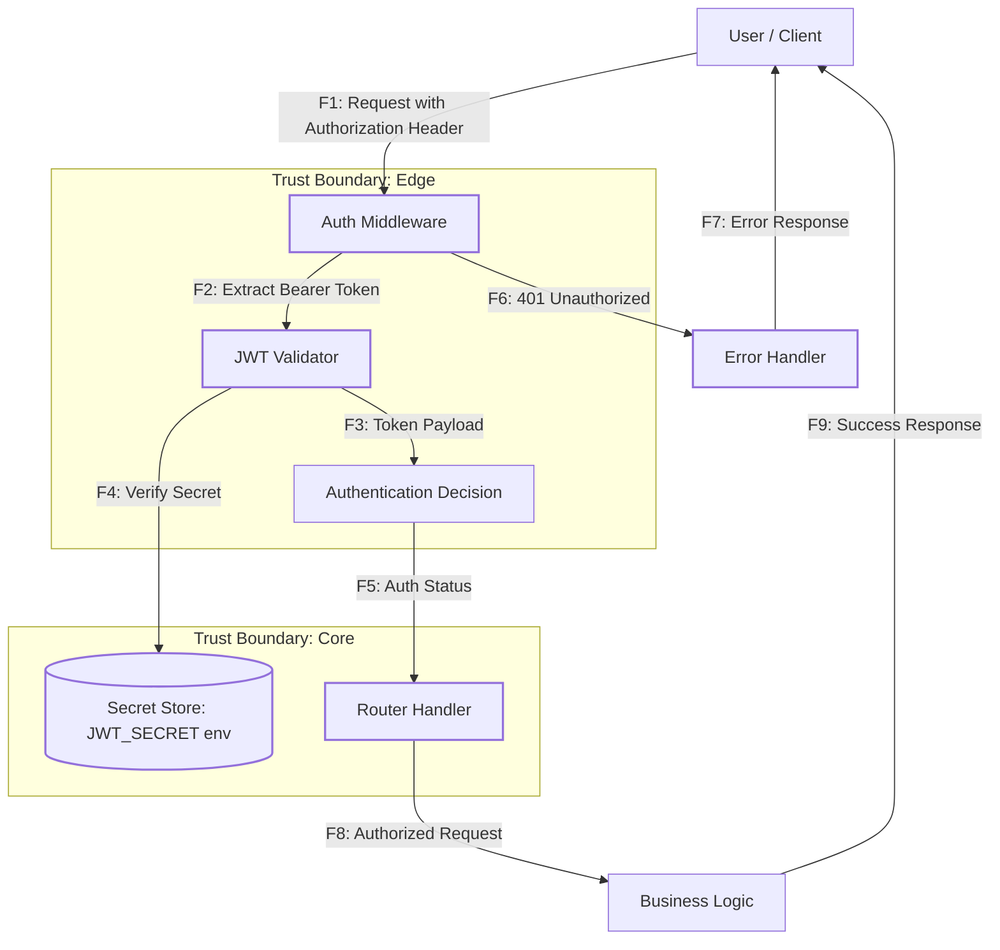

# DFD: Аутентификация и авторизация

Диаграмма потока данных для процесса аутентификации и авторизации пользователей в Wishlist API.

## Описание потоков данных

| Поток | Описание | Защита |
|-------|----------|--------|
| F1 | HTTPS запрос с заголовком `Authorization: Bearer <token>` | HTTPS шифрование |
| F2 | Извлечение JWT токена из заголовка | Валидация формата заголовка |
| F3 | Декодирование и валидация payload токена | Проверка алгоритма, подписи |
| F4 | Проверка секрета для верификации подписи | Секрет в переменной окружения |
| F5 | Решение об аутентификации (успех/неудача) | 401 при ошибке валидации |
| F6 | Обработка ошибки аутентификации | Маскирование деталей ошибки |
| F7 | Ответ об ошибке аутентификации | Без раскрытия причины отказа |
| F8 | Авторизованный запрос к бизнес-логике | Дальнейшая обработка |
| F9 | Успешный ответ с данными | Стандартный JSON ответ |

## Границы доверия

- **Edge (Trust Boundary: Edge)**: Пограничный слой обработки аутентификации
  - Middleware извлекает и проверяет токен
  - Не доверяет клиенту (проверяет подпись)

- **Core (Trust Boundary: Core)**: Ядро системы
  - Бизнес-логика выполняется только после успешной аутентификации
  - Секрет хранится в изолированном хранилище

## Угрозы и контрмеры

| Угроза | Поток | Контрмера | Связь с STRIDE |
|--------|-------|-----------|----------------|
| Подделка токена | F1, F2 | Проверка подписи JWT (F3, F4) | S: Spoofing → R1 |
| Перехват токена | F1 | HTTPS шифрование | I: Information Disclosure → R2 |
| Утечка секрета | F4 | Хранение в env, не в коде | I/T: Secrets Leak → R10 |
| Обход аутентификации | F5 | Строгая проверка перед доступом | E: Elevation of Privilege → R6 |

## Связь с другими документами

- **STRIDE.md**: Угрозы S (Spoofing), E (Elevation)
- **RISKS.md**: Риски R1, R6, R10
- **NFR-02**: Требование аутентификации
- **ADR-002**: Решение о выборе JWT
