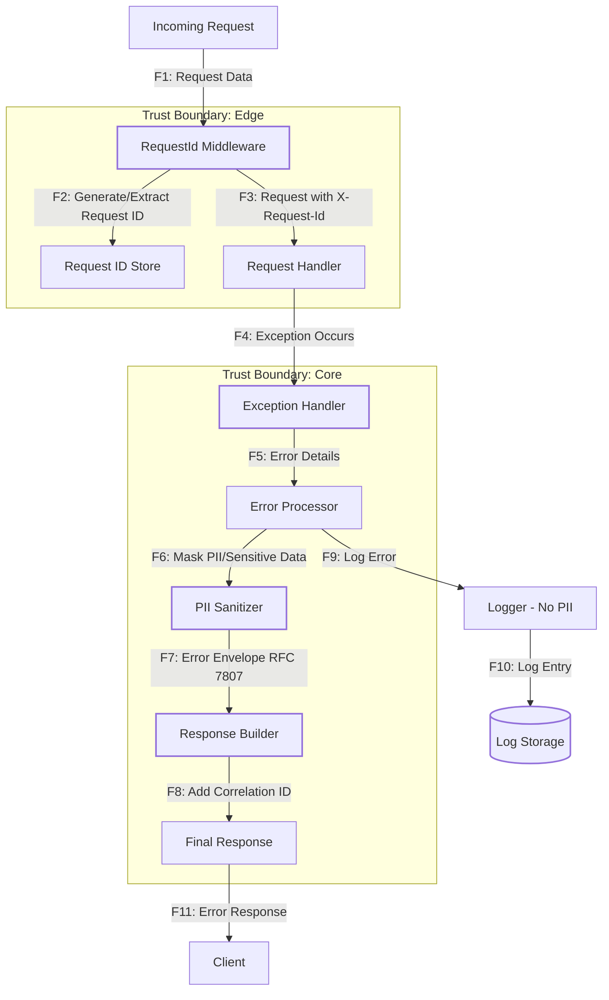

# DFD: Обработка ошибок и логирование

Диаграмма потока данных для централизованной обработки ошибок и корреляции запросов.



## Описание потоков данных

| Поток | Описание | Защита |
|-------|----------|--------|
| F1 | Входящий запрос с данными | HTTPS |
| F2 | Генерация или извлечение Request ID | UUID v4 |
| F3 | Запрос с добавленным X-Request-Id | Корреляция запросов |
| F4 | Возникновение исключения | Централизованная обработка |
| F5 | Детали ошибки передаются в обработчик | Изоляция контекста |
| F6 | Маскирование PII и чувствительных данных | Удаление email, токенов и т.д. |
| F7 | Формирование структурированного ответа RFC 7807 | Стандартизированный формат |
| F8 | Добавление correlation_id в ответ | Трассировка инцидентов |
| F9 | Логирование ошибки без PII | Принцип минимизации данных |
| F10 | Сохранение лог-записи | Без стектрейсов в продакшене |
| F11 | Отправка безопасного ответа клиенту | Без утечки внутренней информации |

## Границы доверия

- **Edge (Trust Boundary: Edge)**: Пограничный слой
  - Middleware генерирует идентификаторы запросов
  - Не доверяет клиенту в передаче корректных ID

- **Core (Trust Boundary: Core)**: Ядро обработки ошибок
  - Санитизация данных перед отправкой клиенту
  - Логирование с контролем конфиденциальности

## Типы обрабатываемых ошибок

1. **HTTP Exceptions** (404, 500 и т.д.)
   - Стандартизированный формат ответа
   - Маскирование деталей внутренней логики

2. **Validation Errors** (422)
   - Ошибки валидации Pydantic
   - Обобщенные сообщения без деталей схемы

3. **Unhandled Exceptions** (500)
   - Общая ошибка без стектрейса
   - Correlation ID для отладки

## Угрозы и контрмеры

| Угроза | Поток | Контрмера | Связь с STRIDE |
|--------|-------|-----------|----------------|
| Утечка PII в ошибках | F5, F6 | PII Sanitizer маскирует данные | I: Information Disclosure → R2 |
| Утечка стектрейсов | F7, F11 | Обобщенные сообщения без деталей | I: Information Disclosure → R9 |
| Отсутствие трассировки | F8 | Correlation ID во всех ответах | R: Repudiation → R4 |
| Утечка PII в логах | F9, F10 | Логирование без PII | I: Information Disclosure → R7 |

## Пример обработки

### Входящая ошибка (внутренняя)
```python
Email: user@example.com
Stack trace: File "...", line 42
SQL query: SELECT * FROM users WHERE email = 'user@example.com'
```

### Исходящий ответ (клиенту)
```json
{
  "error": {
    "code": "internal_error",
    "message": "unexpected error",
    "correlation_id": "550e8400-e29b-41d4-a716-446655440000"
  }
}
```

### Лог-запись (без PII)
```
[ERROR] correlation_id=550e8400... error_code=internal_error status=500
```

## Связь с другими документами

- **STRIDE.md**: Угрозы I (Information Disclosure), R (Repudiation)
- **RISKS.md**: Риски R2, R4, R7, R9
- **NFR-01**: Формат ошибок и маскирование PII
- **NFR-10**: Корреляция ошибок через X-Request-Id
- **ADR-001**: Решение о централизованной обработке ошибок
